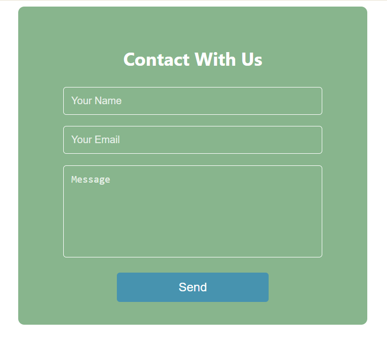
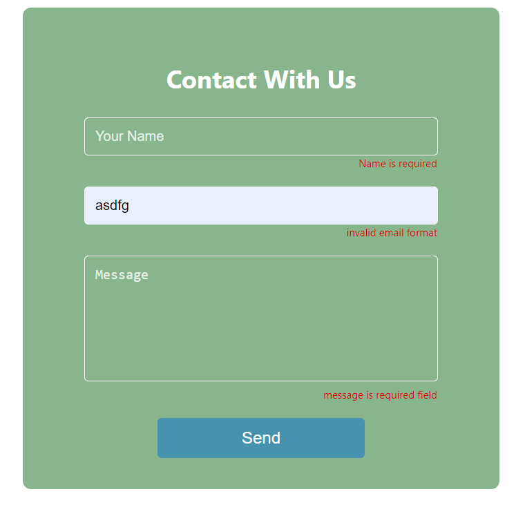

## Contact Us Page
This is a contact us page built using React, TypeScript, and CSS. It utilizes the React Hook Form library to manage form state, perform data validation, and handle form submission.

## Features
Responsive Design: The contact us page is designed to be responsive and accessible on various devices and screen sizes.

Form Validation: The form fields are validated using the React Hook Form library, ensuring that the user provides valid input before submitting the form.

Data Handling: The form data is managed using the React Hook Form library, allowing for easy access to the submitted information.

Submission Handling: The form submission process is handled using the React Hook Form library, providing a seamless user experience.

## images of the page

# error message displayed by react useform hook

## Technologies Used
React: A JavaScript library for building user interfaces.

TypeScript: A superset of JavaScript that adds optional static typing.

CSS: Cascading Style Sheets used for styling the contact us page.

React Hook Form: A library for managing form state, validation, and submission.

## Installation
1. Clone the repository
2. Navigate to the project directory
3. Install the dependencies
5. Start the development server

## Usage
Navigate to the contact us page.

Fill out the form fields, including name, email, and message.

The form will automatically validate the input, and the user will be notified of any errors.

Once the form is filled out correctly, click the "Submit" button to send the contact information.